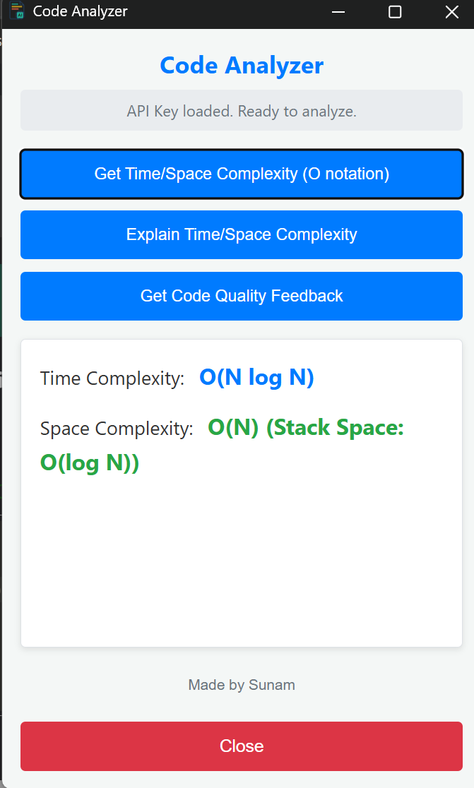
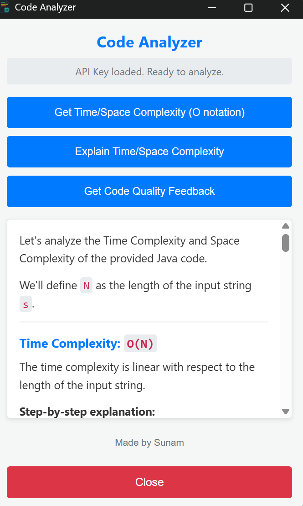
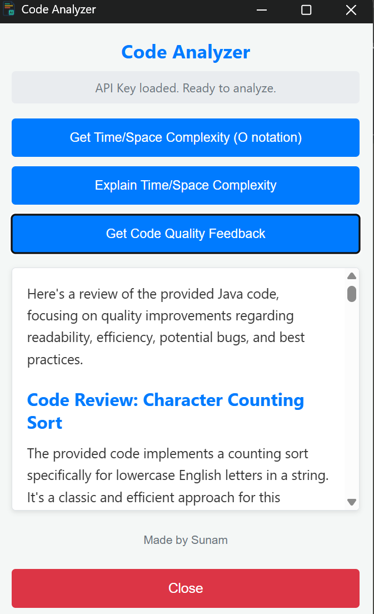

# AI Code Analyzer - Chrome Extension

> Instantly analyze code complexity and quality from any webpage using Google's Gemini AI

A powerful Chrome extension that helps developers analyze code snippets for time/space complexity and code quality directly from coding platforms like LeetCode, GeeksforGeeks, CodeChef, and Codeforces.

[](https://github.com/sunamkundal01/AI-Code-Analyzer---Chrome-Extension-V-2.0)
[](https://ai.google.dev/)

---

## Key Features

- **Complexity Analysis** - Get instant Big O notation for time and space complexity
- **Detailed Explanations** - Understand how complexities are derived with step-by-step breakdown
- **Code Quality Feedback** - Receive actionable tips on readability, efficiency, and best practices
- **Works Everywhere** - Analyze code from any webpage with a simple copy and click
- **Secure & Private** - Your Gemini API key is stored locally in your browser
- **Fast & Free** - Powered by Google's Gemini 2.0 Flash model (free tier available)

---

## Screenshots

### Time/Space Complexity Analysis


_Get instant Big O notation analysis for your code_

### Detailed Complexity Explanation


_Understand the reasoning behind complexity calculations_

### Code Quality Feedback


_Receive actionable suggestions to improve your code_

---

## Installation

### Method 1: Install from Source

1. **Clone or Download this repository**

   ```bash
   git clone https://github.com/sunamkundal01/AI-Code-Analyzer---Chrome-Extension-V-2.0.git
   ```

2. **Open Chrome Extensions Page**

   - Navigate to `chrome://extensions/` in your Chrome browser
   - Or click Menu → More Tools → Extensions

3. **Enable Developer Mode**

   - Toggle the "Developer mode" switch in the top-right corner

4. **Load the Extension**
   - Click "Load unpacked"
   - Select the extension folder containing `manifest.json`
   - The extension icon will appear in your Chrome toolbar

---

## How to Use

### First-Time Setup

1. **Configure Your API Key** (One-time setup)

   - Right-click the extension icon in the toolbar
   - Select "Options"
   - Paste your Gemini API Key
   - Click "Save Key"

   > **Don't have an API key?** Get one free from [Google AI Studio](https://aistudio.google.com/apikey)

### Analyzing Code

1. **Select Code** - Highlight any code snippet on a webpage
2. **Copy** - Press `Ctrl+C` (Windows/Linux) or `Cmd+C` (Mac)
3. **Click Extension** - Click the extension icon in your toolbar
4. **Choose Analysis Type**:
   - **Get Time/Space Complexity** - Quick Big O notation
   - **Explain Complexity** - Detailed breakdown
   - **Code Quality Feedback** - Improvement suggestions
5. **View Results** - Analysis appears instantly in the popup

---

## Getting Your Gemini API Key

1. Visit [Google AI Studio](https://aistudio.google.com/apikey)
2. Sign in with your Google account
3. Click "Create API Key"
4. Copy the generated key
5. Paste it in the extension's Options page

> **Free Tier:** The Gemini 2.0 Flash model offers a generous free tier perfect for daily coding practice

---

## Tips & Troubleshooting

| Issue                      | Solution                                                            |
| -------------------------- | ------------------------------------------------------------------- |
| **"API Key not set"**      | Configure your API key in Options (right-click extension icon)      |
| **Selection not working?** | Always copy (`Ctrl+C` / `Cmd+C`) the code after selecting it        |
| **API Errors**             | Check your API key validity or free tier limits in Google AI Studio |
| **Long code snippets**     | Break large files into smaller logical sections for analysis        |

---

## Tech Stack

- **Frontend:** HTML, CSS, JavaScript
- **API:** Google Gemini 2.0 Flash
- **Markdown Rendering:** Marked.js
- **Platform:** Chrome Extension Manifest V3

---

## Future Enhancements

- [ ] User-selectable Gemini models (Flash, Pro, etc.)
- [ ] Test cases generation and validation
- [ ] Smart hints for when you're stuck on a problem
- [ ] Multiple approach suggestions for solving problems
- [ ] Alternative solution hints with complexity trade-offs
- [ ] Analysis history and saved results
- [ ] Support for multiple programming languages
- [ ] Dark mode UI
- [ ] Export results as PDF/Markdown

---

## Author

**Sunam Kundal**

[](https://github.com/sunamkundal01)

## Support

## Support

If you find this extension helpful, please consider:

- Starring this repository
- Reporting bugs or requesting features via [Issues](https://github.com/sunamkundal01/AI-Code-Analyzer---Chrome-Extension-V-2.0/issues)
- Contributing to the project

---

## Acknowledgments

- Powered by [Google Gemini AI](https://ai.google.dev/)

---

<div align="center">
Made with love by Sunam Kundal
---

<div align="center">
Made with love by Sunam Kundal
</div>
